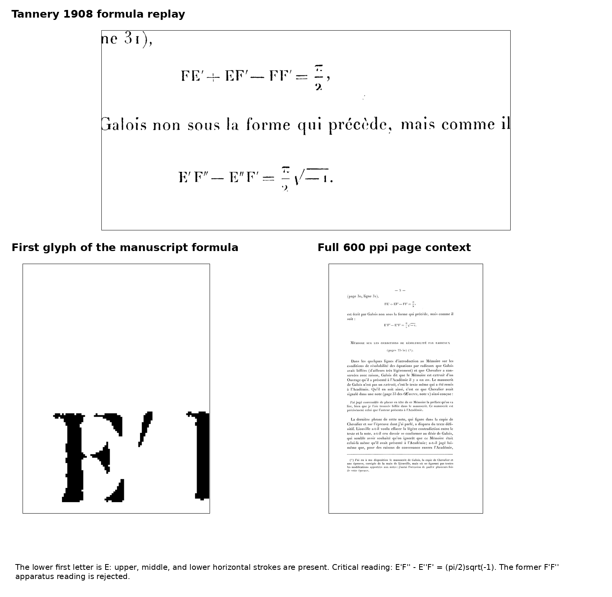

# POST-P13-A008 — W08-WV001, Legendre relation

Critical-layer certificate. The frozen 78-page P13R diplomatic edition is immutable.

**Status:** repaired

**Source replay.** The frozen 1897 target and the 1846 publication print

\[
FE' + EF' - FF' = \frac{\pi}{2}.
\]

Tannery's 1908 collation states that Galois wrote the same theorem in another form. Direct inspection of the 600 ppi TIFF master corrects a defect in the former GPT apparatus: the first letter of the manuscript formula has three horizontal strokes and is **E**, not **F**. Tannery prints

\[
E'F''-E''F'=\frac{\pi}{2}\sqrt{-1}.
\]

The earlier apparatus form \(F'F''-E''F'\) is therefore rejected as a secondary-witness transcription error. This correction does not alter the 1897 diplomatic text.

{ width=95% }

**Theorem (equivalence of the two Legendre forms).** Put

\[
F=K(k),\qquad F_c=K(k'),\qquad E=E(k),\qquad E_c=E(k').
\]

The printed relation is

\[
EF_c+E_cF-FF_c=\frac{\pi}{2}.
\]

Choose the real/imaginary half-period pair and a compatible second-kind pair by

\[
\omega_1=F,\qquad \omega_2=iF_c,
\qquad
\eta_1=E,\qquad \eta_2=i(F_c-E_c).
\]

Then

\[
\begin{aligned}
\eta_1\omega_2-\eta_2\omega_1
 &=E(iF_c)-i(F_c-E_c)F\\
 &=i(EF_c+E_cF-FF_c)\\
 &=\frac{\pi i}{2}.
\end{aligned}
\]

Identifying Tannery's manuscript symbols by

\[
E'=\eta_1,\qquad F''=\omega_2,\qquad E''=\eta_2,\qquad F'=\omega_1
\]

gives exactly

\[
E'F''-E''F'=\frac{\pi i}{2}.
\]

The chosen second-kind period vector is admissible, not merely an algebraic relabelling. Start with any second-kind differential having the same normalized principal part and period vector $(\widetilde\eta_1,\widetilde\eta_2)$. The Riemann bilinear relation gives the same determinant $\pi i/2$. Hence the difference between the desired vector and the initial vector has zero wedge product with $\omega=(\omega_1,\omega_2)$, so it is $c\omega$ for some constant $c$. Adding $c$ times the holomorphic first-kind differential realizes exactly the desired period vector.

This identification is compatible with the usual freedom to add a multiple of a first-kind differential to a second-kind differential: replacing \(\eta_j\) by \(\eta_j+c\omega_j\) leaves the determinant invariant, since

\[
(\eta_1+c\omega_1)\omega_2-(\eta_2+c\omega_2)\omega_1
 =\eta_1\omega_2-\eta_2\omega_1.
\]

Thus the manuscript determinant and the 1846/1897 complete-integral formula express the same Legendre relation under an explicit half-period/quasi-period normalization. Reversing the orientation of the second cycle changes the signs of both second-cycle quantities; Tannery's displayed right-hand side fixes the orientation represented in his transcription.

**Historical adjudication.** Tannery 1908 is the earliest securely dated explicit notice located: he prints both forms and states that Galois wrote the theorem in the determinant form. DLMF 19.7.1 supplies the modern complete-integral identity. Beppo Levi's 1927 paper is explicitly devoted to the half-period/quasi-period determinant \(\eta_1\omega_2-\eta_2\omega_1=\pi i/2\), confirming that the determinant normalization is a standard Legendre relation rather than a different theorem.

**Propagation.** Neither formula is used in a later deduction in the 1897 letter. The repair closes the witness-variant task and corrects the critical apparatus only; it has no downstream change to the diplomatic edition or to later Galois proofs.
