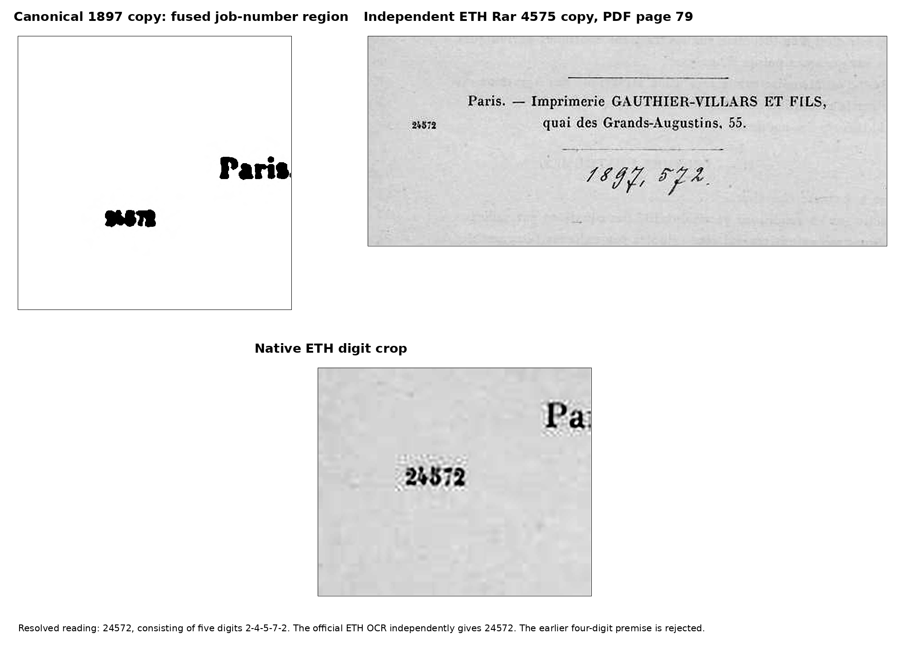

# W11-DA002 — printer job number

Critical-layer certificate. The frozen 78-page P13R diplomatic edition is immutable.

**Status:** proved

**Independent witness.** The official ETH-Bibliothek digitization of the independent 1897 copy, shelfmark Rar 4575 and DOI 10.3931/e-rara-19915, was retrieved from the library's public download endpoint. Its PDF page 79 contains the colophon. The small printer number to the left of the second line is visibly

\[
\boxed{24572}.
\]

It has five digits, not four. The official ETH OCR independently transcribes `24572` on the same colophon page.

{ width=95% }

**Character-by-character certificate.** In the independent image, the first and fifth glyphs have the curved upper stroke, diagonal descent, and basal stroke of `2`; the second has the vertical and cross-stroke structure of `4`; the third has the top bar and lower bowl of `5`; and the fourth has a top bar with descending diagonal, hence `7`. The sequence is therefore `2-4-5-7-2`. The canonical JP2 remains locally fused, but its five dark glyph components are consistent with the independent reading. The independent image, rather than the OCR alone, is decisive.

**Disposition.** `W11-U001` is closed in the critical layer with reading `24572`. The historical 1897 diplomatic page is not re-typeset or silently altered; the critical appendix and machine-readable resolution ledger carry the reading and evidence. No Gauthier-Villars printer register was needed after recovery of the independent comparison copy.
